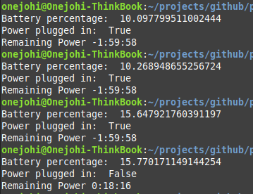

# Laptop Battery Information

LBP is a Python app that displays the battery percentage, if the laptop has been powered on and how many hours, minutes and seconds left of operation

## Installation

For your development, you would need to install psutil

```bash
pip install psutils
```

## Screenshots



## Contributing
Pull requests are welcome. For major changes, please open an issue first to discuss what you would like to change.

Please make sure to update tests as appropriate.

## License
[MIT](https://choosealicense.com/licenses/mit/)